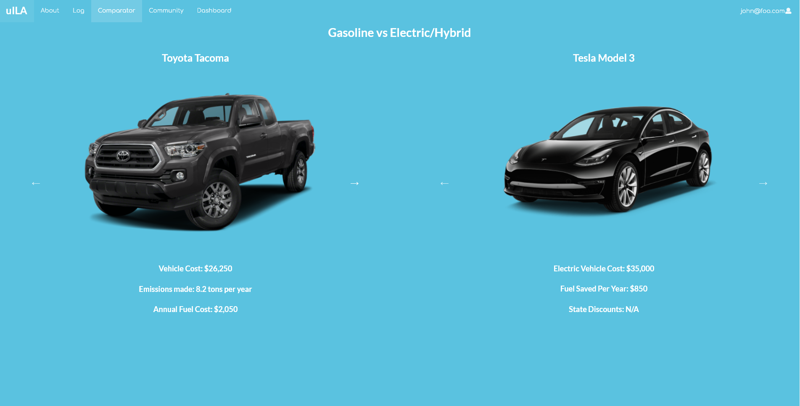
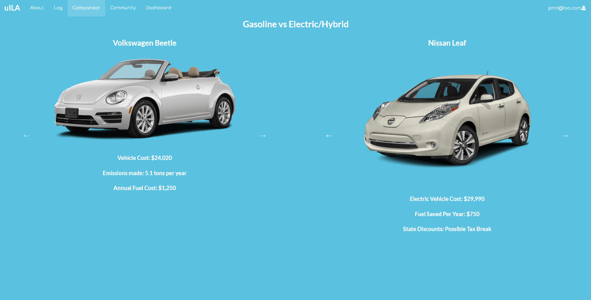
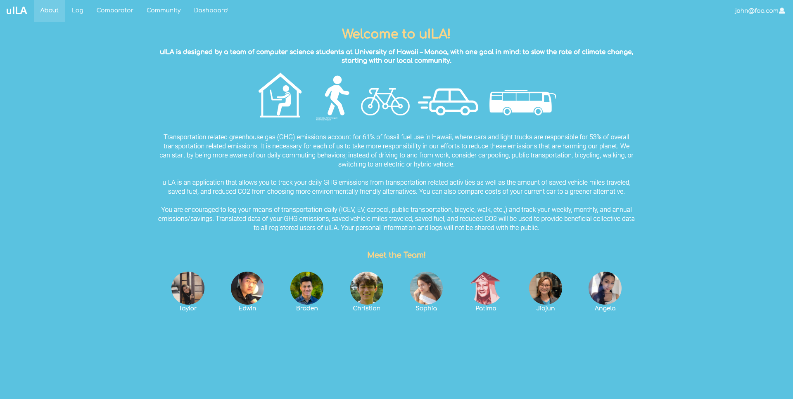
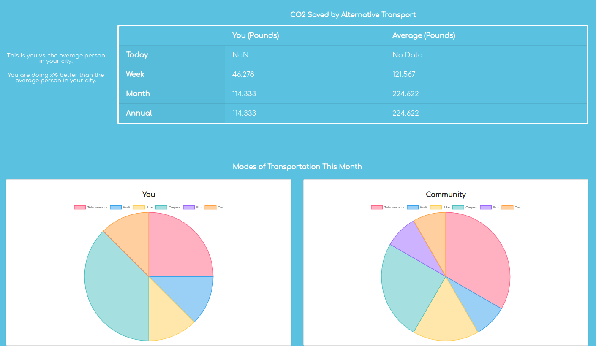
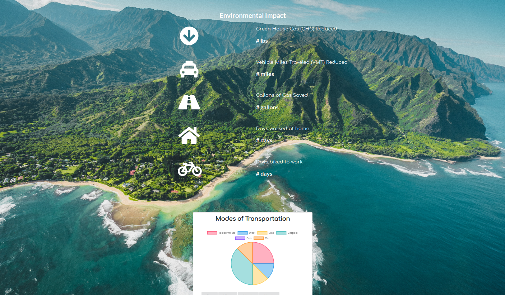
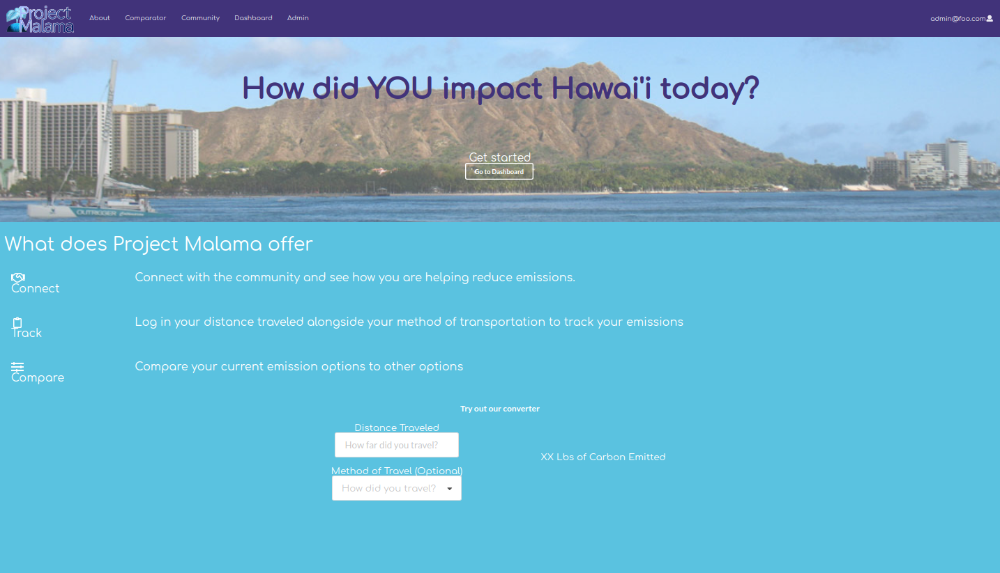

## Table of contents

* [Project Goal](#project-goal)
* [Meeting Summaries](#meeting-summaries)
* [Application Design](#application-design)
* [Mockup Pages](#mockup-pages)
* [The Team](#the-team)

## Project Goal

 Our goal is to create an application to encourage the community to be more mindful of how they commute to reduce greenhouse gas (GHG) emissions associated with transportation. Users can track their daily, weekly, monthly, or annual GHG, and how their data lines up with other people in the same area. 

## The Team

* [Taylor](https://github.com/tgabatin)
* [Edwin](https://github.com/edwin-zheng)
* [Braden](https://github.com/bradenbetz)
* [Christian](https://github.com/christianjensenv)
* [Sophia R.]()
* [Patima](https://github.com/patimapoochai)
* [Jiajun](https://github.com/JiajunK)
* [Angela](https://github.com/angcylau)

## Milestone 1 Completed

 Basic mockup of the app has been created and mockups for individual pages has been linked. 

 Comparator page has also been added, and the About Us page has also been updated. 

## Updated Mockups

 New car comparator page with some minor functionality. 

 Updated login page. 

 Updated about page. 

## Milestone 2 Completed
### 02/25/2021

The following tasks were accomplish in milestone 2:

<ul>
  <li> Revamp the dashboard </li>
  <li> Rework and integrate the databases: UserTransportation, UserInfo, UserVehicles </li>
  <li> Redesign the landing page and home page </li>
  <li> Create basic visualization: pie charts, CO2 table, dashboard statistics </li>
  <li> Integrating CO2 and emission calculation into the application </li>
</ul>

### Updated pages

 Community page 

 Dashboard page 

 Home page 

 After completing milestone 2, we moved any unfinished tasks to milestone 3. We generate the tasks for the next milestone as a team, and the tasks are as follows:

<ul>
  <li> Rework landing page </li>
  <li> Create page footer </li>
  <li> Fix landing page's text overlap on small screen </li>
  <li> Add a widget comparing weekly average vs daily CO2 saved to the dashboard </li>
  <li> Add widgets that show user's historical data to the dashboard </li>
  <li> Continue working on emission calculator </li>
  <li> Add a component to compare user data against existing data from online APIs on dashboard </li>
  <li> Add widgets that visualize user data vs the community data to the community page </li>
</ul>

## Meeting Summaries

### 02/04/2021

#### Mockups

Our about page is up:

Members worked on additional ideas for how our car comparator should look:

Also we now have a polished logo to use for our web application to further bring together our ideas about what we are trying to achieve:

#### Progress

We also have a more clear idea of how we are going to accomplish our issues to keep us on track for Milestone 2.

### 01/28/2021

#### Application Design
A flowchart, roughly outlining the basic design of the application and how it will work:

Front end developers will begin converting mockups to React pages.

#### Mockup Pages

Backend developers will start on creating functions for basic conversions (e.g., converting miles traveled to GHG emissions), and comparing users' current vehicles to more sustainable options.

### 01/21/2021

 We came up with a general goal and assignments for each team member. The assignment is as follows:

<ul><li> Design & Mockup: Jiajun & Sophia </li>
  <li> Math function: Christian & Angela </li>
  <li> Database schema: Patima & Taylor </li>
  <li> Login & user account : Branden & Edwin </li></ul>

 Because some of these assignments are harder than the other, we do not have set dates for completion just yet. We want to get our feet wet and find out what we need as we go for now. 

### 02/09/2021

 Updated information on assignments for team members for presentation on Thursday. 

<ul><li>Work on the basic databases for the program, find out which car emissions are most popular in Hawaii</li>
    <li> Work on the comparator page for the cars </li></ul>

 We hope to have a functioning layout page by the base presentation date. We will focus on functionality of the site after M1. Primary focus is to link the pages together and get a base understanding of how we want the flow of our application to work. 

### 02/16/2021

 We decided on Project Malama as a name. We're mostly ready for Thursday, but have to make small tweaks to prepare for the meeting with the client.

