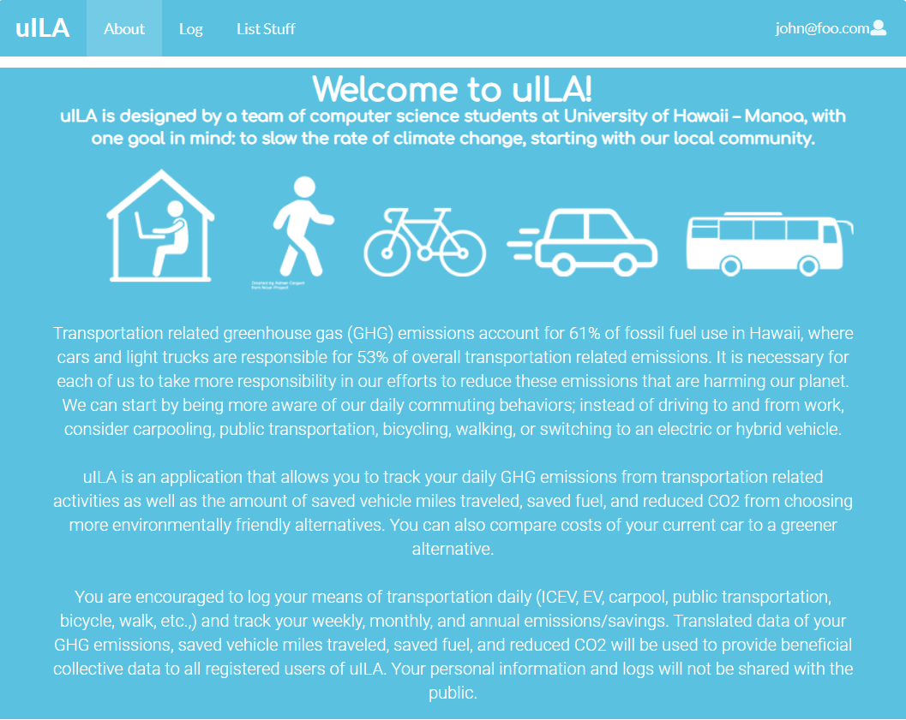
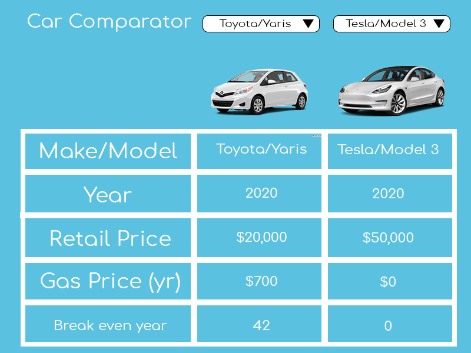
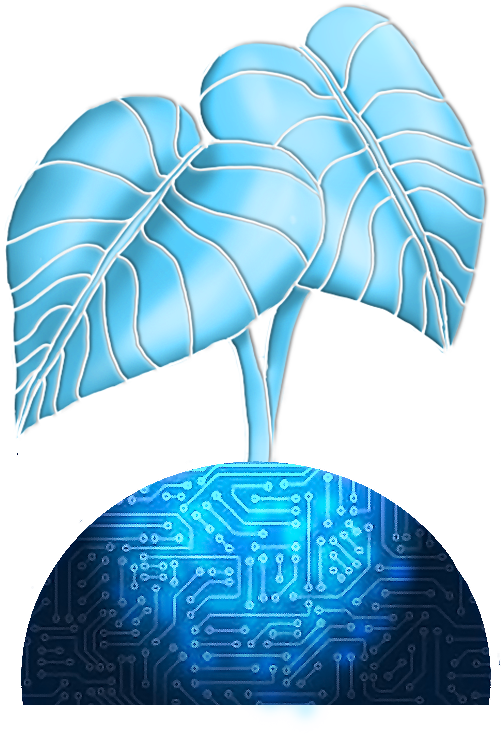
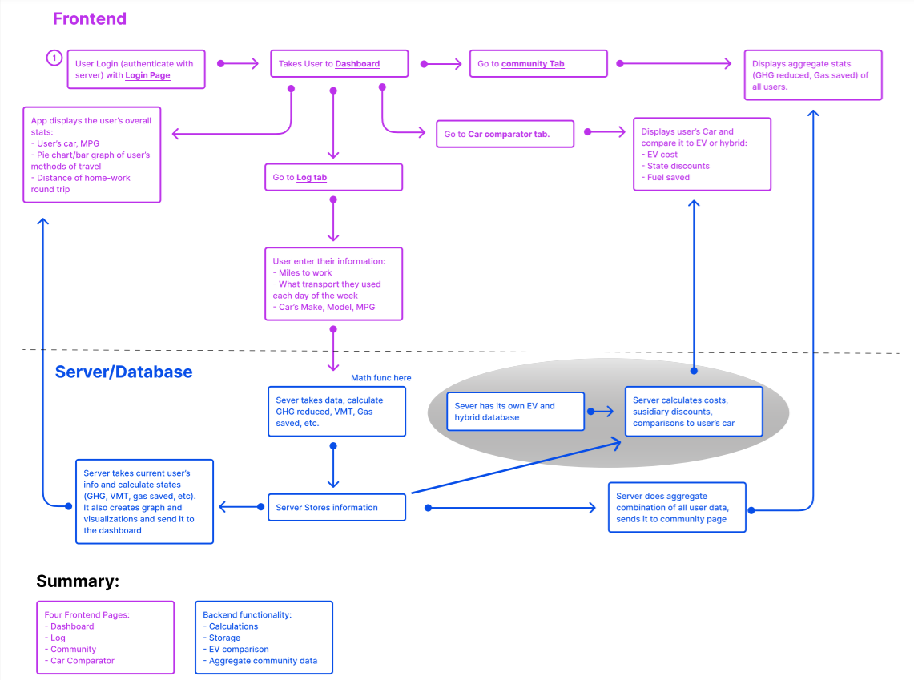
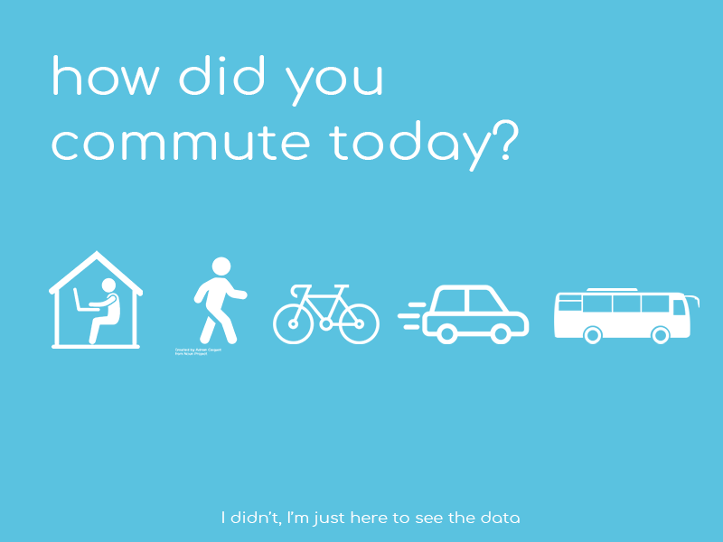
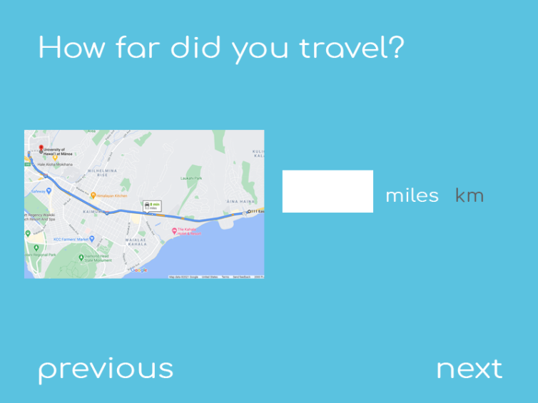
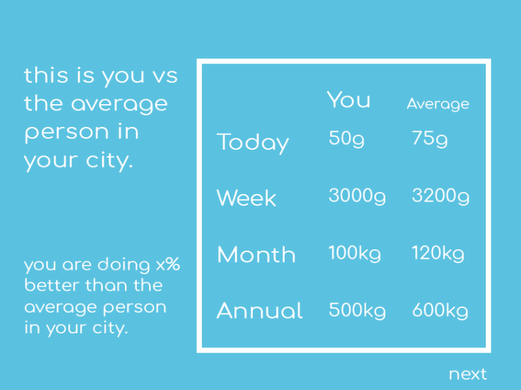
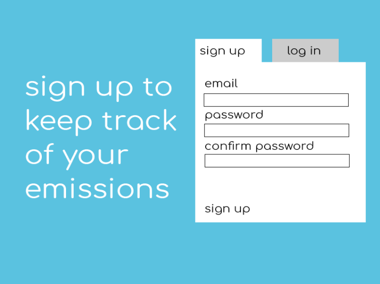
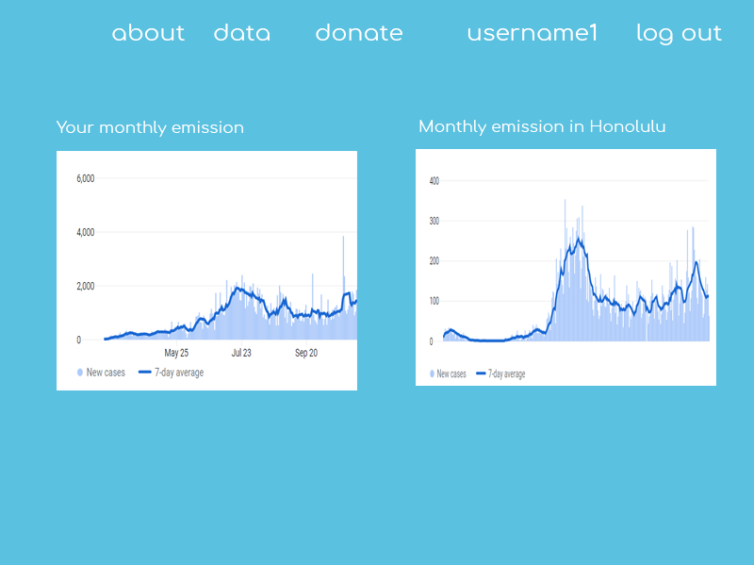

## Table of contents

* [Project Goal](#project-goal)
* [Meeting Summaries](#meeting-summaries)
* [Application Design](#application-design)
* [Mockup Pages](#mockup-pages)
* [The Team](#the-team)

## Project Goal

 Our goal is to create an application to encourage the community to be more mindful of how they commute to reduce greenhouse gas (GHG) emissions associated with transportation. Users can track their daily, weekly, monthly, or annual GHG, and how their data lines up with other people in the same area. 

## The Team

* [Taylor](https://github.com/tgabatin)
* [Edwin](https://github.com/edwin-zheng)
* [Braden](https://github.com/bradenbetz)
* [Christian](https://github.com/christianjensenv)
* [Sophia R.]()
* [Patima](https://github.com/patimapoochai)
* [Jiajun](https://github.com/JiajunK)
* [Angela](https://github.com/angcylau)

## Meeting Summaries

### 02/04/2021

####Mockups 

Our about page is up:

Members worked on additional ideas for how our car comparator should look:

Also we now have a polished logo to use for our web application to further bring together our ideas about what we are trying to achieve:

####Progress

We also have a more clear idea of how we are going to accomplish our issues to keep us on track for Milestone 2.

### 01/28/2021

#### Application Design
A flowchart, roughly outlining the basic design of the application and how it will work:

Front end developers will begin converting mockups to React pages.

#### Mockup Pages

Backend developers will start on creating functions for basic conversions (e.g., converting miles traveled to GHG emissions), and comparing users' current vehicles to more sustainable options.

### 01/21/2021

 We came up with a general goal and assignments for each team member. The assignment is as follows:

<ul><li> Design & Mockup: Jiajun & Sophia </li>
  <li> Math function: Christian & Angela </li>
  <li> Database schema: Patima & Taylor </li>
  <li> Login & user account : Branden & Edwin </li></ul>

 Because some of these assignments are harder than the other, we do not have set dates for completion just yet. We want to get our feet wet and find out what we need as we go for now. 

