## Table of contents

* [Overview](#overview)
* [Current Screenshots](#current-screenshots)
* [Future Updates](#future-updates)
* [Developer Guide](#developer-guide)
* [The Team](#the-team)


## Overview
<p> Our goal is to create an application to encourage the community to be more mindful of how they commute to reduce greenhouse gas (GHG) emissions associated with transportation. Users can track their daily, weekly, monthly, or annual GHG, and how their data lines up with other people in the same area. </p>

## Current Screenshots
<h4> Landing </h4>
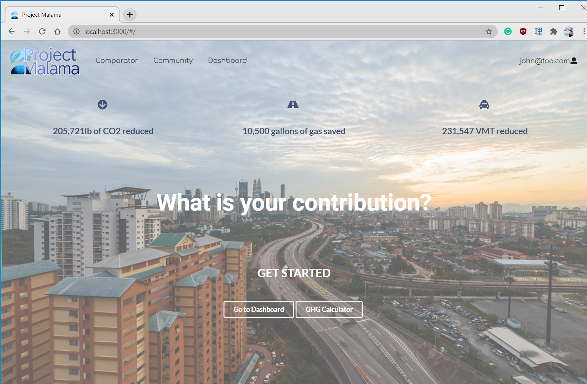
<p>Upon loading in on the application, the user is greeted by the landing page. If the user is currently logged in, the buttons will display "Dashboard" and "GHG Calculator". If the user is not logged in, the buttons will display "Sign in" and "Sign up".</p>
<h4> Comparator </h4>
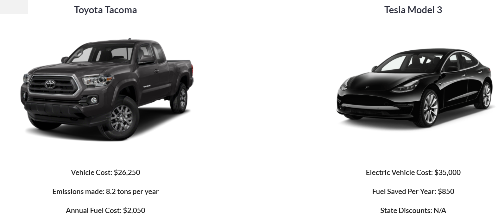
<p>The comparator page shows different diesel vehicles compared to electric vehicles. </p>
<h4> Community </h4>
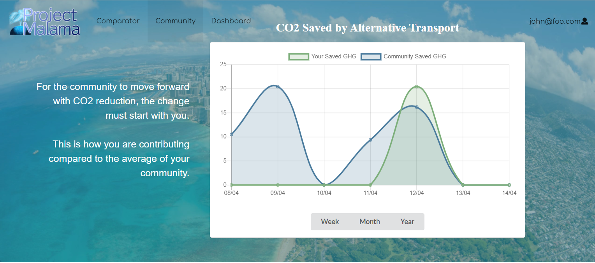
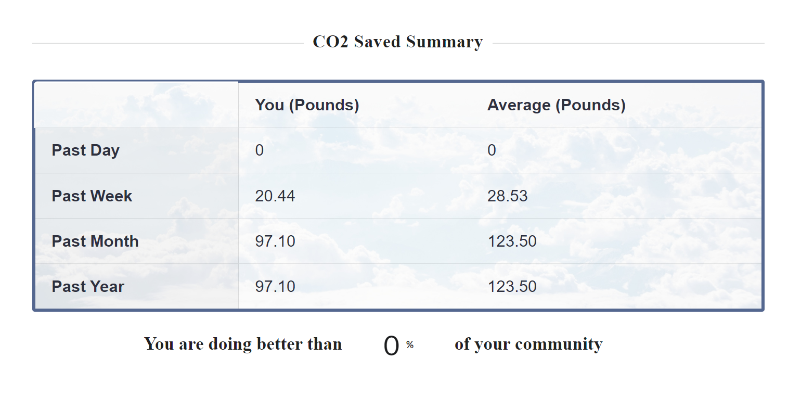
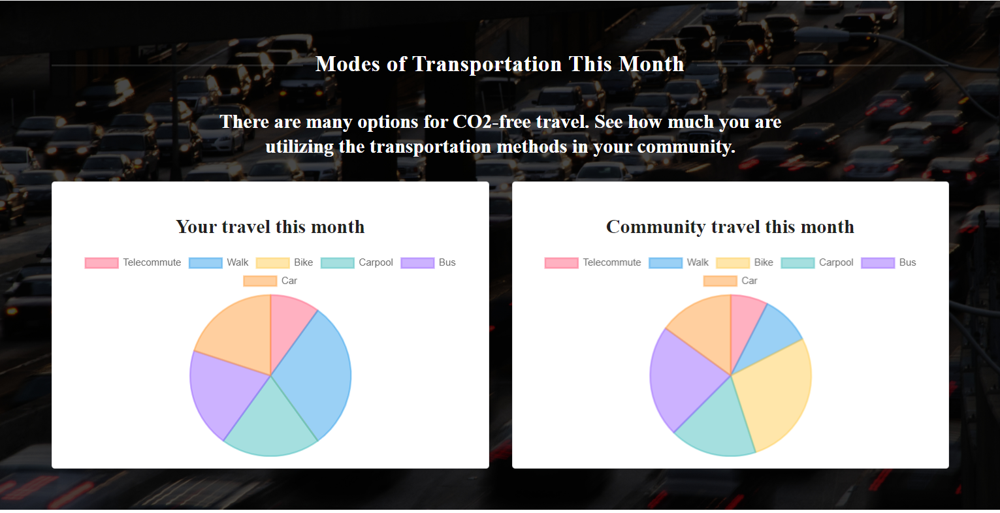
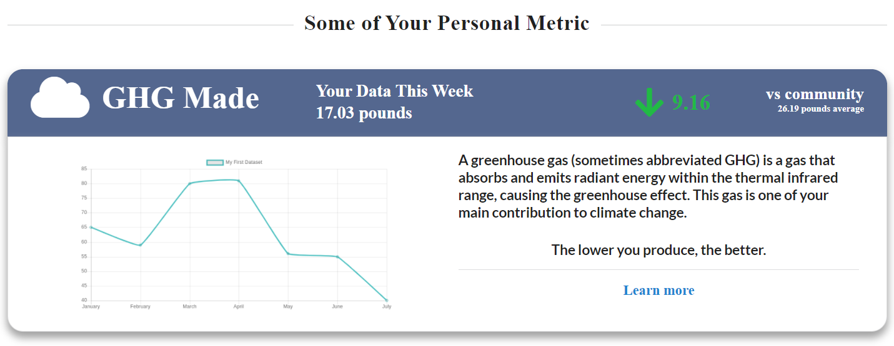
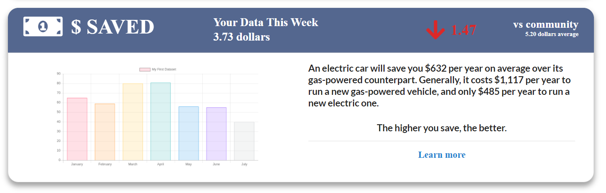
<p>This page shows how the user is doing compared to the community. It updates in real time the user inputs as well as other users' inputs. There are toggles of weekly, monthly, and annual options for the graph so the user can fully understand their impact. The inidividual's travel pattern, carbon emmision, and money saved pattern can also be viewed on this page.</p>
<h4> Dashboard </h4>
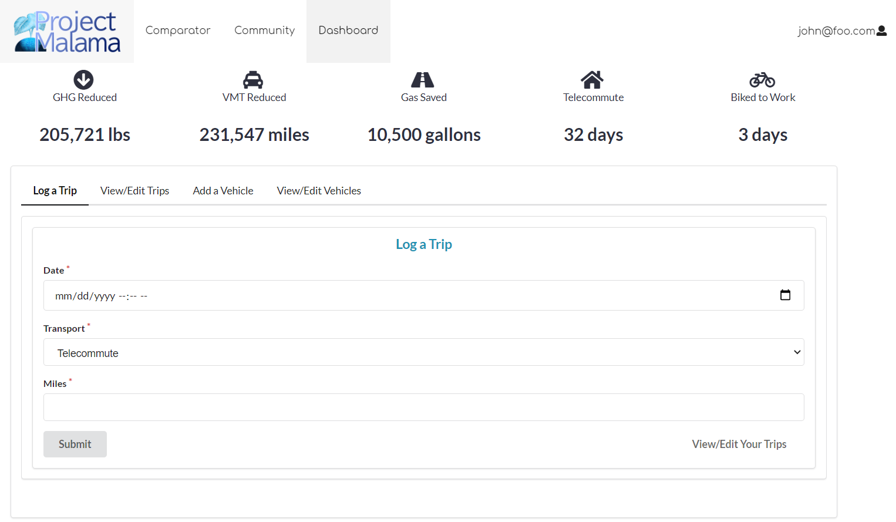
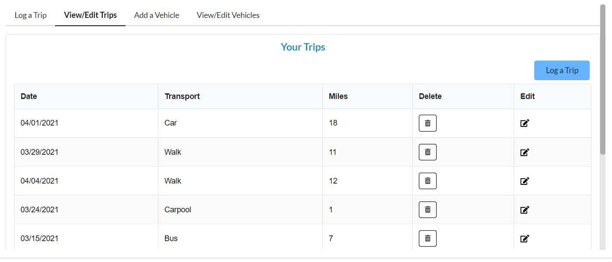
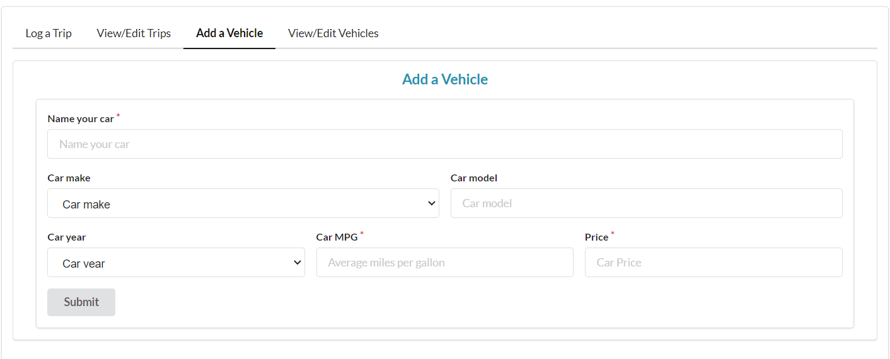
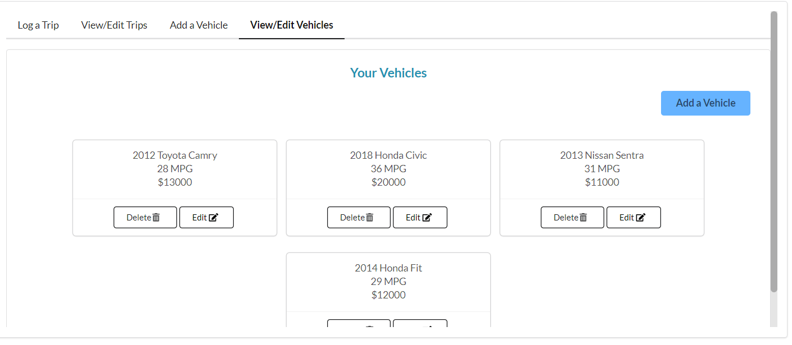
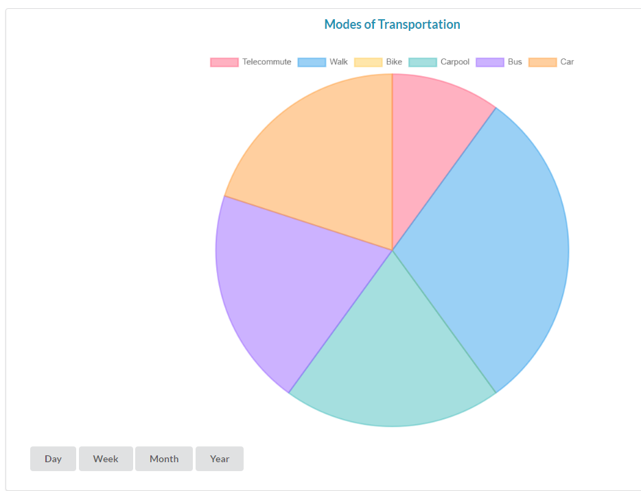
<p>This is the page where user can input new data. Users can select what mode of transportation they made on a certain day and how far they have commuted. If the user makes a mistake, they can easily go back to the recorded trips and edit or delete their data. User can also add multiple vehicles if needed. This page will also update in real time with the community page shown earlier.</p>
<h4> Profile </h4>
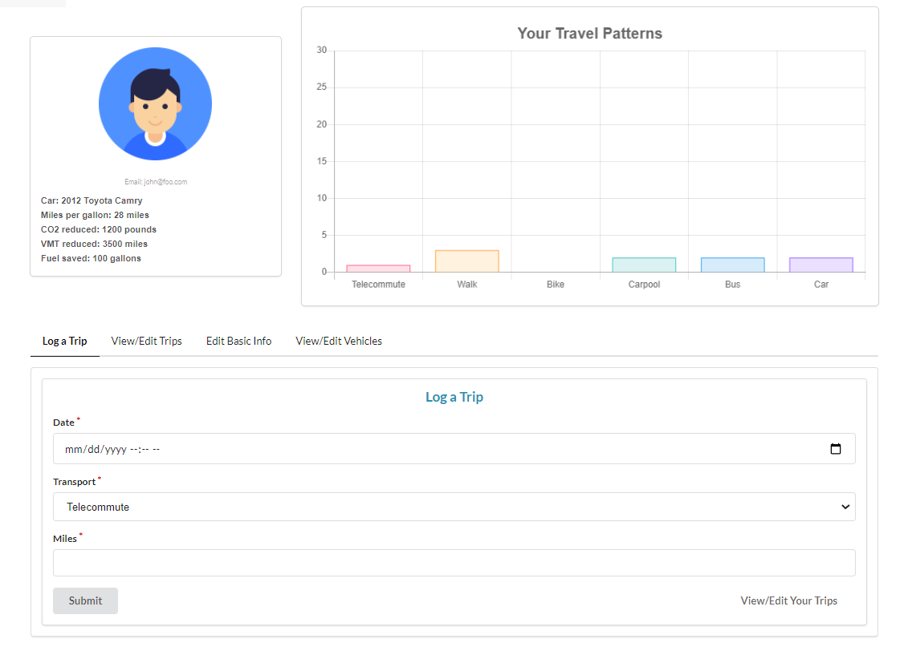
<p>This is another page where the user can look at their travel patterns, as well as log more trips. The user can also adjust their vehicle, name, and profile icon. </p>
<h4> Sign in/Sign up </h4>
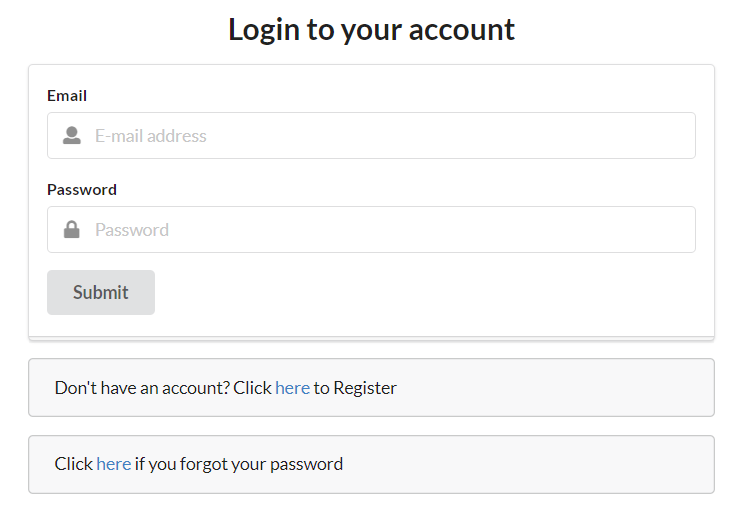
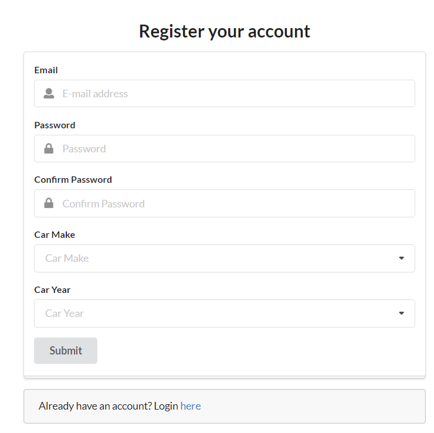
<p>Of course the users have to start somewhere. This is the page where user can either sign in to their pre-existing accounts, or sign up for a new one. </p>

## Future Updates
<p>This project is still a work in progress. Please follow our Github project board to see our upcoimng updates and plans for this app. </p>

# DEVELOPER GUIDE
***
This section provides information to Meteor developers on how to use this code base as a basis for their own development projects and tasks.

### Installation

First, <a href="https://www.meteor.com/install">install Meteor</a>.

Second, go to the <a href="https://github.com/virtual-manoa-coders/vmc-uILA">Project Malama repo</a>, and click the "Clone or download" button to download your new GitHub repo to your local file system. Using GitHub Desktop is a great choice if you use MacOS or Windows.

Fourth, cd into the app/ directory of your local copy of the repo, and install third party libraries with:
```
$ meteor npm install
```

### Running the system

Once the libraries are installed, you can run the application by invoking the "start" script in the package.json file:
```
$ meteor npm run start
```

### Viewing the running app
If all goes well, the application will appear at [http://localhost:3000](http://localhost:3000). You can login using the credentials in settings.development.json, or else register a new account.

<br/>

## The Team

* [Taylor](https://github.com/tgabatin)
* [Edwin](https://github.com/edwin-zheng)
* [Braden](https://github.com/bradenbetz)
* [Patima](https://github.com/patimapoochai)
* [Jiajun](https://github.com/JiajunK)
* [Angela](https://github.com/angcylau)
